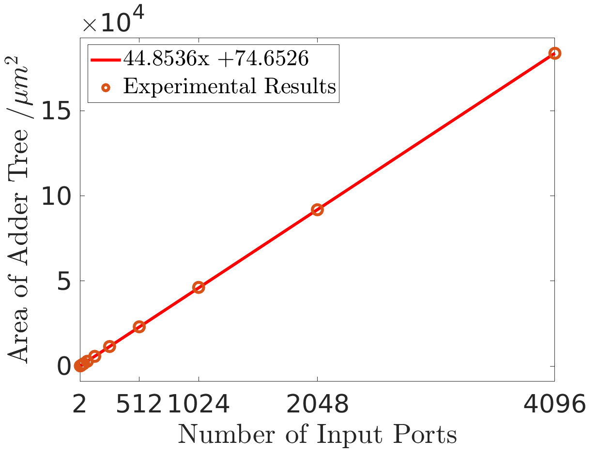
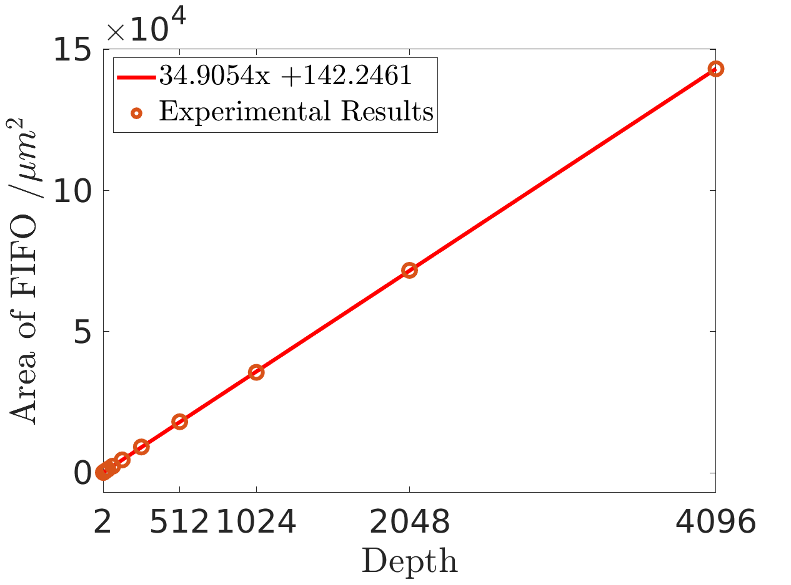
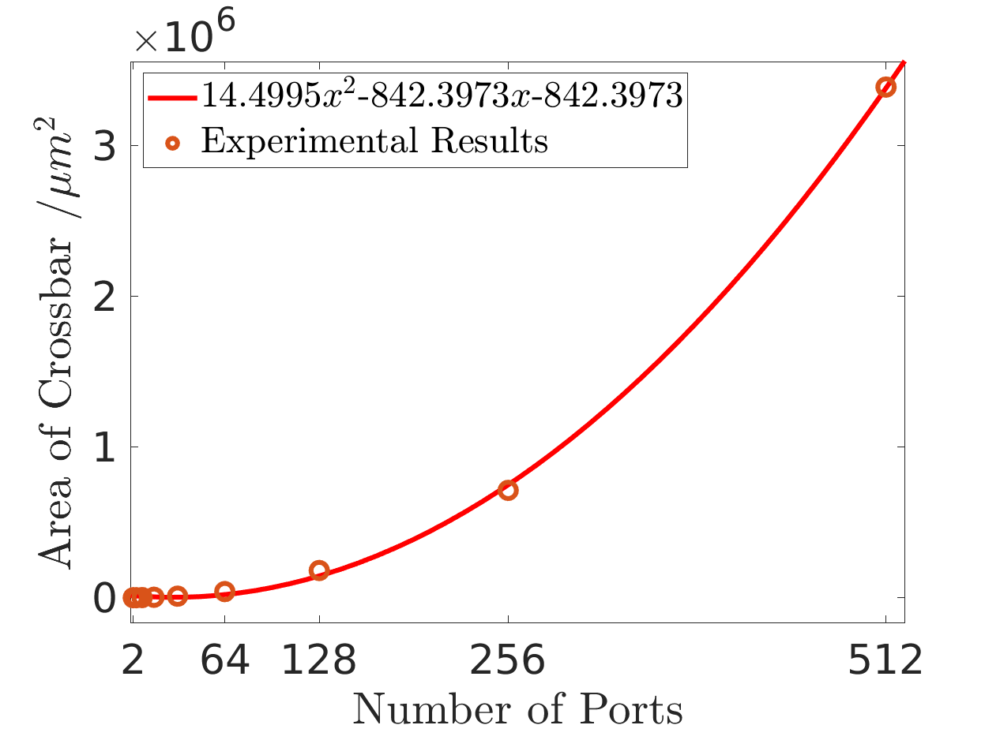
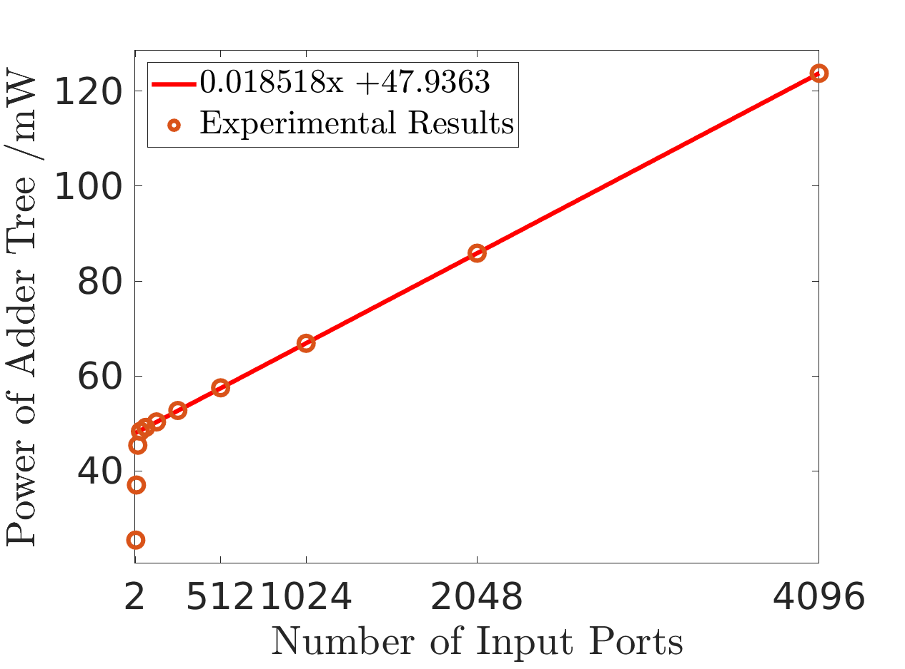
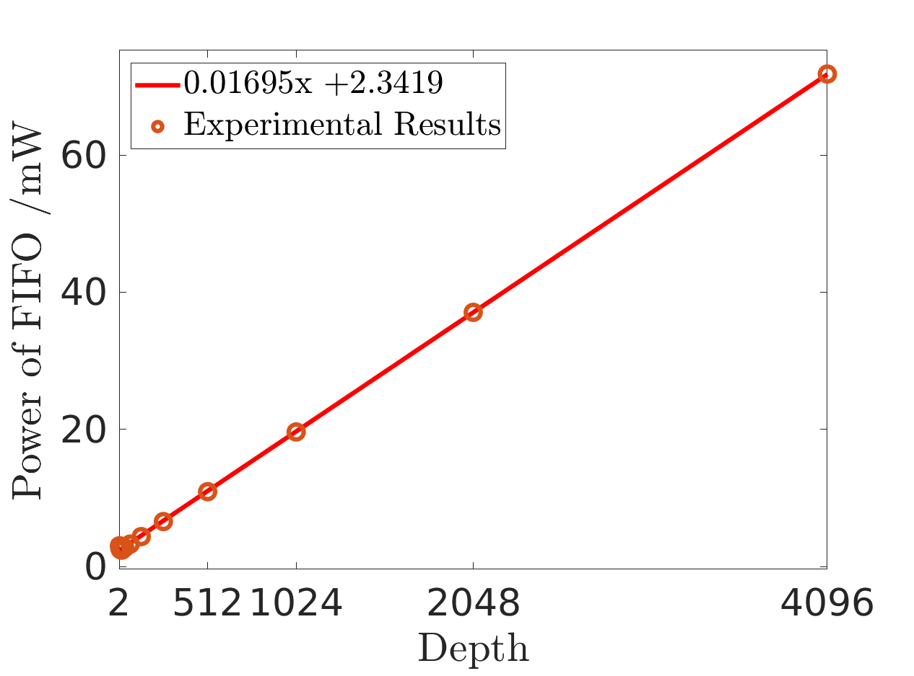
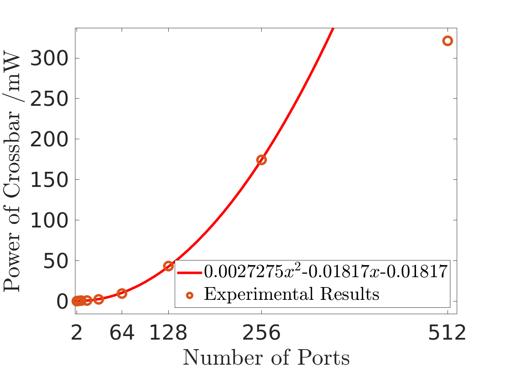

# Verilog Synthesis using Synopsys Synthesis

This repo implements area and power estimation using synopsys design compiler (DC), which could also serve as templates to test both *combinational circuits* and *sequential circuits*. 

- Three salable modules have been tested here, including 2~512 input crossbar, 4~4096 input adder tree and 2~4096 depth sychronous FIFO, as shown in different directories of **src**.
- All verilog modules are tested using TSMC 28nm libraries, as shown in the **db** library (they are just part of libraries.) While the supporting nangate libraries are located in **lib** directory.
- The estimated results are stored in the result directory with the sub-directory name as ```<module>/report<size>``` . where ```<module> = fifo/ adder_tree/ crossar``` and ```<size> =2 ~ 4096```
- **configuration** specifies which library we are using and the corresponding environment variables and files in need of test.
- To reduce the tedious work of testing the same module with different parameters, a wrapper python script is designed for all of three modules, as shown in **script** directory.
- For ease of usage, a parser is designed to collect all results together into **Activation_Function_report.rpt** and **document.rpt**. The parser is located in **parser** directory.

# Usage
Here is a detail description of using dc to estimate combinational circuits and sequential circuits manually.
Altough automatical wrapper scripts are offered in scripts/python_wrapper sub-directory, to study the following stuffs are suggested.

## 1. Setup Bash
```
source ./configuration/bash_setup.sh
```

## 2. Add `.v` files to `./src` directory
To create a new directory for a new design is suggested here.

## 3. Update `./configuration/sources_list.tcl`(sequential circuit) or  `./configuration/sources_list_combination.tcl`(combinational circuit) file to indicate newly added Verilog files
```
set work_dir work
analyze -work $work_dir  -format verilog { ./src/fifo/c_fifo.v ./src/fifo/c_fifo_ctrl.v ./src/fifo/c_dff.v ./src/fifo/c_regfile.v ./src/fifo/c_decr.v ./src/fifo/c_incr.v }
elaborate c_fifo -work $work_dir
```
The files located between ```{``` and ```}``` should be changed. And the name of the top module should be put behind the ```elaborate```. In this way, the top module will be tested under the default value of parameters set in the .v file. Change the parameter value of .v file to get area and power of different files.

## 4. Review `./configuration/environment.tcl`(sequential circuit) or `./configuration/environment_combination.tcl`(combinational circuit)
- For combinational circuits, there is no clock input in .v file. Therefore, a virtual clock should be created using the following command.
```
set clock_name "clk"
create_clock -period 2.5 -waveform {0 1.25} -name $clock_name
```

- For sequential circuits, we only need to set the name of input clock signal.
```
set clock_name "clk"
```

## 5. Run synthesize using `dc_script.tcl`(sequential circuit) or `dc_script_combination.tcl`(combinational circuit)
Note: the *root directory* in `dc_script.tcl` is the place to store the output report files. Specifically, all report files will be output in the `root directory/report/`.
To manually start dc for sequential circuits, please run
```
dc_shell-t -f ./scripts/dc/dc_script.tcl
```

To manually start dc for combinational circuits, please run
```
dc_shell-t -f ./scripts/dc/dc_script_combination.tcl
```

## 6. Check Area, Power and Timing Report
Reports are saved into `root directory/report/` directory.

## 7. temporary files are saved into `./work` directory.

# Automatical Scripts Usage
The automatical file is designed to repeat synthesizing the same module with different size. All `alter` lines are specifically designed for the target .v module, which should be manually changed when modules change.
## 1. Modify the target verilog file.
```
funcs = ["fifo"]      # The result will be stored in `./result/<funcs[0]>/report<test_width>`
file_path   = "./src/fifo/c_fifo.v" # Specify the file containing the top module 
elaborate_name = "c_fifo" # Specify the name of the top module

```

## 2. Modify all supporting verilog files.
All modules instantiated in the top module should be listed here separated by comma.
```
depend_file_path = ["./src/fifo/c_fifo_ctrl.v", "./src/fifo/c_dff.v", "./src/fifo/c_regfile.v", "./src/fifo/c_decr.v", "./src/fifo/c_incr.v"]
```

## 3. Choose combinational or sequential circuit
set `is_sequntial` to 1 if the design is a sequential module.

## 4. Change the parameter of specified module
The alter function will change the line containing the `<SEPECIFIC STRING>` into `<NEW LINE>`. 

```
alter(<FILE_PATH>, <SEPECIFIC STRING>, <NEW LINE>)
```
To change the parameter of the top module file, modify the following line.
```
alter(file_path, "parameter depth =", "   parameter depth = " + str(i) + ";\n")
```

## 5. Change to the root directory of the repo 
```
cd <...>/Area_Power/
```

## 6. run the python wrapper script
- For sequential circuits, please set `is_sequential = 1`, otherwise set `is_sequential = 0`
- All test input size should be specified in `test_widths = [8, 16, 32, 64, 128, 256, 512, 1024, 2048, 4096]`. And users also need to be manually change `alter(file_path, "parameter depth =", "   parameter depth = " + str(i) + ";\n")` into the parameters designed by the .v files.
```
python3 ./scripts/python_wrapper/run_dc.py
```

# Result Illumination





